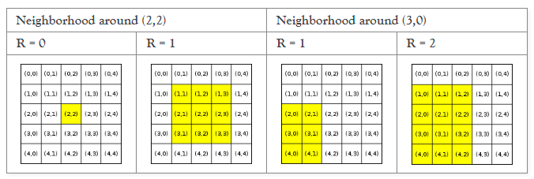

# Schelling's Model of Housing Segregation
By: Jerry Shi

## Introduction
In [*Micromotive and Macrobehavior*](https://www.google.com/books/edition/Micromotives_and_Macrobehavior/DenWKRgqzWMC), economist and Nobel laureate Thomas C. Schelling explored how individual preferences and choices can lead to community level effects, i.e. segregation. Specifically, Schelling examined instances of mild racial preferences, between the extremes of absolute indifference and intolerance towards the race of neighbors. While segregation is a complicated issue that is not fully explained by this model, Schelling's model is notable for showing how individuals with weak preferences for similar neighbors can end up in segregated neighborhoods as the result of their collective choices. 

## Setup
In order to represent a city, we use a square, 2-D array of size ***N*** x ***N***. Every cell at ***(i, j)*** represents a home/homeowner. The R-neighborhood, or neighborhood of size ***R***, of each home contains all locations ***(k ,l)*** within the boundaries of the city such that ***i - R ≤ k ≤ i + R*** and ***j - R ≤ l ≤ j + R***.

Homeowners are either *maroon*, represented by an **M**, or *blue*, represented by a **B** in this simulation. Each homeowner's satisfaction is represented by two metrics:
* Similarity score = S/H where S is the number of homes in the neighborhood with occupants of the same color as the homeowner and H is the number of occupied homes in the neighborhood.
* Occupancy score = H/T where H is as defined previously, and T is the total number of locations (occupied and unoccupied) in the neighborhood.

A homeowner is satisfied when **both** their similarity score **and** ocupancy score is higher than **or** equal to their threshold scores. If a homeowner is unsatisfied, they will move to a satisfactory home with the closest distance to their current home. Distance is measured using Manhattan distance: |r2−r1|+|c2−c1|. If there are multiple satisfactory homes within the same minimum distance, the homeowner will move to the location that has been vacant the least amount of time. However, an unsatisfied homeowner will not relocate if there is one (or no) satisfactory home available.

The simulation runs in row-major order. That is, we start with the first row and iterate through the columns, then repeat for each remaining row.

## Features

The following functionality is completed:

<!-- 👉🏿👉🏿👉🏿 Make sure to check off completed functionality below -->
- [X] **A logical component structure in HTML is used to create the app**
- [X] **Javascript is used to dynamically update an HTML table representing the grid of residents**
- [X] **Updating the forms in the page updates the variables used in the simulation**
- [X] **EvenListeners are used to provide start, stop, reset, and step button functionality**
- [X] **% Satisfied and Round updates with each round**
- [X] **The simulation automatically stops when the grid is completely satisfied or maxRounds is reached**

The following **stretch** features are planned:

- [ ] Refactor to incorporate React, including hooks, stated, and forms
- [ ] Deploy site to the web for anyone to use

## Video Walkthrough

Here's a walkthrough of implemented required features:

GIF created with ...  [LICEcap](https://www.cockos.com/licecap/)

## License

Copyright [2023] [JJerry Shi]

Licensed under the Apache License, Version 2.0 (the "License"); you may not use this file except in compliance with the License. You may obtain a copy of the License at

> http://www.apache.org/licenses/LICENSE-2.0

Unless required by applicable law or agreed to in writing, software distributed under the License is distributed on an "AS IS" BASIS, WITHOUT WARRANTIES OR CONDITIONS OF ANY KIND, either express or implied. See the License for the specific language governing permissions and limitations under the License.